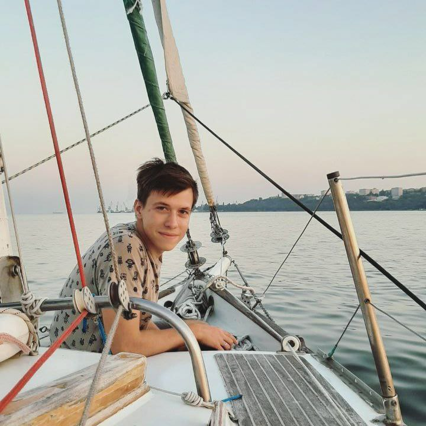

# ПОРТФОЛИО
## Всем привет, меня зовут Анатолий, мне 24. 

 
Я учусь на Frontend-разработчика в [Нетологии](https://netology.ru/). На данный момент работаю инженером в компании по производству светодиодных светильников, работа интересная, но к программированию тянет больше...

На данный момент я прошел несколько модулей по программе Frontend-разработчик с нуля:
- HTML-верстка: с нуля до первого макета
- Адаптивная и мобильная верстка
- Основы программирования
- Git — система контроля версий (прохожу на данный момент)
  
Также выполнил несколько итоговых работ:
- [по модулю адаптивная и мобильная верстка](https://kiraradi.github.io/MQ-50/)
- [По модулю основы программирования](https://replit.com/@AnatoliiKatieln/Diplom-startovyi-kod#logic.js)